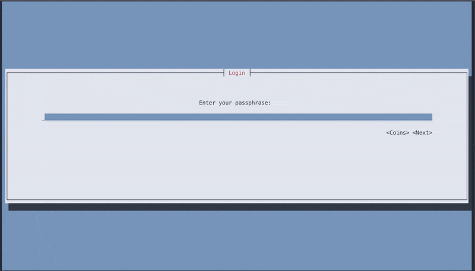

# Kamel

A tool for marketmakers to run a marketmaker instance from a VPS using SSH.

This works, because this GUI works through ncurses, a way of making a graphical interface using the terminal.

## This is very much a work in progress

